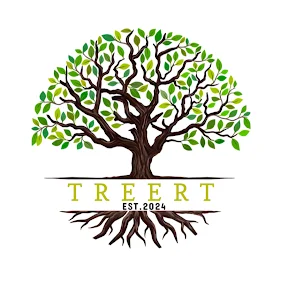

# TREERT Exports & Imports Website

A modern, responsive website for TREERT - Premium Agricultural Exports from India.



## 🚀 Features

- **Modern Design** - Clean, professional UI with smooth animations
- **Fully Responsive** - Works on all devices
- **Fast Performance** - Built with Vite + React
- **SEO Optimized** - Meta tags and semantic HTML
- **Tailwind CSS** - Utility-first styling with custom theme
- **TypeScript** - Type-safe code

## 📁 Project Structure

```
treert-website/
├── public/
│   └── logo.png
├── src/
│   ├── components/
│   │   ├── Navbar.tsx
│   │   ├── Hero.tsx
│   │   ├── Stats.tsx
│   │   ├── Services.tsx
│   │   ├── Gallery.tsx
│   │   ├── Certificates.tsx
│   │   ├── Quality.tsx
│   │   ├── WhyChoose.tsx
│   │   ├── Founders.tsx
│   │   ├── Contact.tsx
│   │   ├── Footer.tsx
│   │   └── WhatsAppButton.tsx
│   ├── pages/
│   │   └── GalleryPage.tsx
│   ├── App.tsx
│   ├── main.tsx
│   ├── index.css
│   └── vite-env.d.ts
├── index.html
├── package.json
├── tailwind.config.js
├── postcss.config.js
├── tsconfig.json
├── tsconfig.node.json
├── vite.config.ts
└── README.md
```

## 🛠️ Installation

1. **Clone or extract the project**

2. **Install dependencies**
   ```bash
   npm install
   ```

3. **Start development server**
   ```bash
   npm run dev
   ```

4. **Build for production**
   ```bash
   npm run build
   ```

5. **Preview production build**
   ```bash
   npm run preview
   ```

## 🎨 Customization

### Colors
Edit `tailwind.config.js` to customize the color palette:
- `primary` - Main green colors
- `accent` - Gold accent colors
- `cream` - Background cream color

### Fonts
The project uses:
- **Playfair Display** - For headings (display font)
- **Inter** - For body text

### Images
Replace placeholder images with your actual product photos:
- Update image URLs in component files
- Add your own images to the `public` folder

### Content
Update content in each component file:
- Company information
- Contact details
- Product descriptions
- Team member details

## 📱 Responsive Breakpoints

- **Mobile**: < 768px
- **Tablet**: 768px - 1024px
- **Desktop**: > 1024px

## 🔧 Tech Stack

- **React 18** - UI Library
- **TypeScript** - Type Safety
- **Vite** - Build Tool
- **Tailwind CSS** - Styling
- **React Router** - Navigation
- **Lucide React** - Icons

## 📞 Contact

- **Phone**: +91 99944 98426
- **Email**: treertngroup@gmail.com
- **WhatsApp**: Floating button included

## 📄 License

© 2024 TREERT Exports & Imports. All rights reserved.
